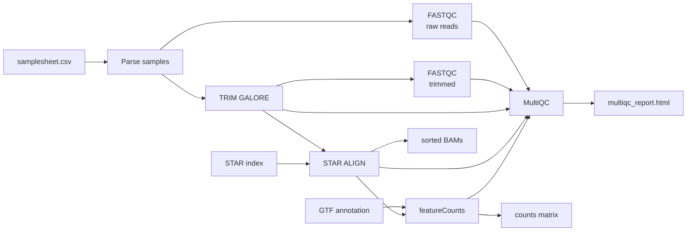
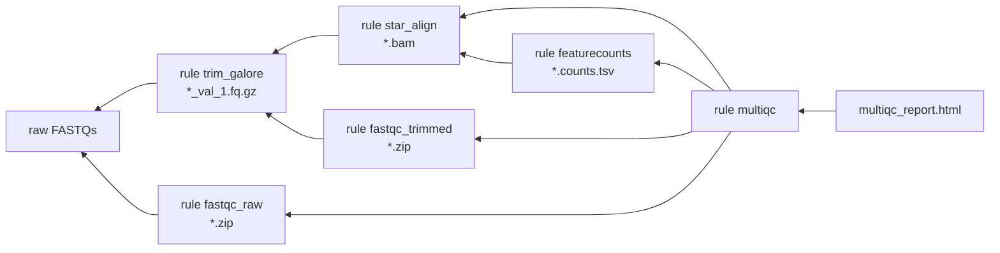
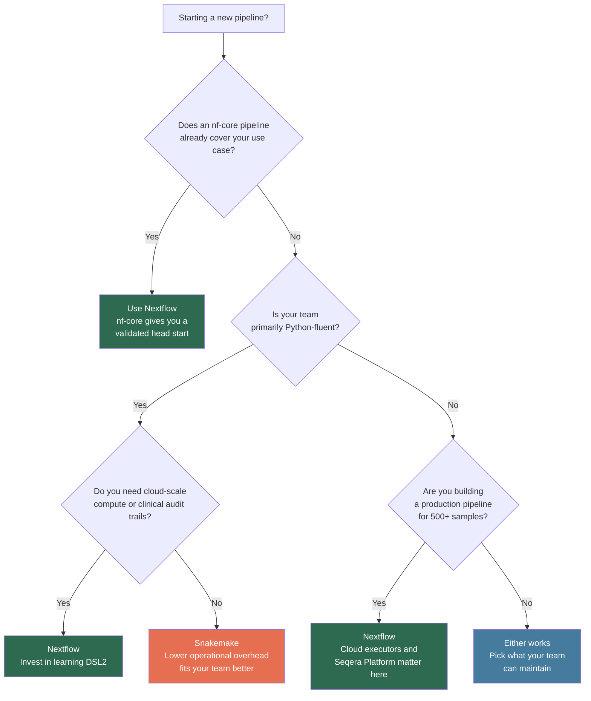

# snakemake-vs-nextflow
# Nextflow vs Snakemake: A Practical Comparison


A reference for bioinformaticians trying to make an informed choice. Not a verdict — both tools are good, and anyone telling you otherwise probably hasn't used both seriously.

---

## Table of Contents

- [Philosophy](#philosophy)
- [Advantages of Nextflow](#advantages-of-nextflow)
- [Advantages of Snakemake](#advantages-of-snakemake)
- [Limitations of Nextflow](#limitations-of-nextflow)
- [Limitations of Snakemake](#limitations-of-snakemake)
- [How a Pipeline Looks in Each Framework](#how-a-pipeline-looks-in-each-framework)
- [Quick Comparison](#quick-comparison)
- [Decision Guide](#decision-guide)
- [References](#references)

---

## Philosophy

The reason these two tools feel so different to use is that they were built on completely different mental models — not just different syntax.

**Nextflow** (CRG Barcelona, 2013) treats a pipeline as a stream of data flowing through processes. Processes are reactive — they fire whenever their input channels have data. You don't tell Nextflow to run sample A, then sample B. You push all your samples into a channel and let the framework handle the parallelism. It's powerful once it clicks, but it does take a while to click.

**Snakemake** (Düsseldorf, 2012) was inspired by GNU Make. You define rules that say how to produce an output file from input files, and Snakemake works backwards from whatever target you want. If you've ever written a Makefile, or if you think about pipelines as a graph of file dependencies — which most bioinformaticians do — Snakemake will feel intuitive from day one.

That difference in design philosophy explains most of the tradeoffs below.

---

## Advantages of Nextflow

### nf-core is genuinely exceptional

It's hard to overstate how useful [nf-core](https://nf-co.re) is. Over 100 peer-reviewed, CI-tested pipelines covering RNA-seq, variant calling, single-cell, methylation, metagenomics — most with Singularity support and consistent parameter schemas. If there's an nf-core pipeline for your use case, you should probably just use it rather than building from scratch. Even if you're writing a custom pipeline, the nf-core modules library has hundreds of tool wrappers you can import directly, which saves a lot of boilerplate.

### Cloud scaling is first-class

Switching from SLURM to AWS Batch is a config change, not a rewrite. Nextflow's executor model was designed for distributed compute from the start — it treats a local workstation, an HPC cluster, and a cloud batch system as interchangeable backends. If you ever need to burst beyond your on-premise cluster, Nextflow makes that much less painful than the alternative.

### `-resume` works the way you want it to

Hash-based caching means Nextflow checks the task inputs *and* the script before deciding whether to re-run something. Change a script, and the affected tasks re-run. Change a parameter that doesn't affect a task, and it doesn't. This sounds obvious but it's actually hard to get right, and it matters a lot when a 72-hour pipeline fails at the last step.

### DSL2 modularisation is clean

The current Nextflow syntax lets you write proper modules with explicit input/output interfaces and import them across pipelines. For teams maintaining multiple workflows, this is genuinely useful — you write a STAR alignment module once and share it everywhere.

---

## Advantages of Snakemake

### Your team already knows Python

This is probably the most practically important advantage and it doesn't get enough credit. Rules are Python. The config is a Python dict. Input functions are lambdas. If your team spends their days writing Python for parsing, stats, and visualisation, Snakemake adds almost no language overhead. You can hand a Snakemake pipeline to a wet-lab collaborator with Python experience and they can read it. Try that with DSL2.

### `--dry-run` is the best debugging tool in the ecosystem

```bash
snakemake --dry-run --reason -j 1
```

This prints every rule that would run, and *why* — which file is missing or outdated. For iterating quickly on pipeline logic before submitting to a cluster, nothing comes close. It's the feature I miss most when working in Nextflow.

### The `benchmark:` directive

Every rule can have a benchmark file that automatically records wall time, CPU time, and peak memory per sample. No extra instrumentation, no log parsing — it just works. When you're trying to figure out why your STAR jobs are getting killed, or making the case to your HPC team for more memory allocation, this data is right there.

### Conda environments per rule

Snakemake can create and activate per-rule Conda environments automatically. On HPCs where Docker isn't available and Singularity isn't set up, this is often the path of least resistance. It's not perfect — environment solve times can be annoying — but it works.

### The report is built in

```bash
snakemake --report report.html
```

Self-contained HTML with the DAG, rule runtimes, and configurable result figures. No external service, no configuration.

---

## Limitations of Nextflow

### Groovy is a real barrier

I don't think this gets acknowledged enough in comparisons. Most bioinformaticians don't know Groovy, and when something breaks, reading a JVM stack trace is not fun. Add to that the JVM startup overhead and a driver process that can easily consume 6–8 GB of RAM — which matters on login nodes with memory limits — and the operational cost of running Nextflow is meaningfully higher than running Snakemake.

### Channel semantics take time to internalise

Getting your samplesheet parsed into the right channel shape, joining it with a shared reference, and handling edge cases like missing samples or variable lane counts — this is where most people spend their first week with DSL2. Operators like `groupTuple`, `join`, `combine`, and `flatMap` are powerful but composing them correctly is non-obvious, and the error messages when you get it wrong aren't always helpful.

### Debugging at scale is cumbersome

When a task fails, you get a work directory path with a hash. At scale there are thousands of these directories. `nextflow log` helps, but the experience of hunting down a failed task is just harder than looking at `logs/star_align/sample.log`.

### Commercial roadmap risk

Nextflow's development is driven largely by Seqera Labs, a VC-backed company. The core is Apache 2.0 licensed so the risk isn't existential, but it's worth being aware of for long-term infrastructure decisions.

---

## Limitations of Snakemake

### There's no nf-core equivalent

Snakemake Wrappers is a solid library of tool wrappers, but it's not the same thing as nf-core. There's no equivalent collection of fully-validated, end-to-end pipelines with consistent interfaces and active maintenance teams. If you want a production-ready WGS or RNA-seq pipeline you can hand to a collaborator tomorrow, nf-core has a real advantage.

### Cloud needs more work

Running Snakemake on AWS is possible but you'll spend more time on it than you would with Nextflow — particularly around S3 path handling, job monitoring, and cluster setup. It's not a blocker, but it's an honest difference.

### Wildcard patterns get hard to read

In simple pipelines the file-based dependency model is intuitive. In complex pipelines with many sample groupings, nested wildcards, and lambda input functions, it can get hard to follow — especially for someone new to the codebase.

### Dynamic outputs are a pain point

If a rule produces a variable number of output files — say, a clustering step that splits samples into an unknown number of groups — you need Snakemake's `checkpoint` mechanism. It works, but it's notably less elegant than Nextflow's channel model for this specific pattern.

### Breaking changes between versions

The v7→v8 migration changed the executor API significantly. If you're setting up a pipeline you expect to maintain for several years, factor in that Snakemake major versions have historically required real migration work.

---

## How a Pipeline Looks in Each Framework

Same biological steps — how each framework expresses the dependency structure.

### Nextflow: data flows through channels



Processes fire reactively. Push 200 samples into the channel — 200 FASTQC jobs fire without any explicit loop.

### Snakemake: rules define file dependencies



Snakemake reads this right-to-left — it asks *"what do I need to produce the target?"* and works backwards. The parallelism is implicit in the DAG structure.

---

## Quick Comparison

| | Nextflow | Snakemake |
|---|---|---|
| Language | Groovy + Bash | Python |
| Mental model | Data flows through channels | Rules produce files from files |
| Learning curve | Steep — channels take time | Gentle for Python users |
| Community pipelines | nf-core (~100+ end-to-end) | Snakemake Wrappers (~400 tools) |
| Cloud support | Excellent, native | Good, more configuration |
| HPC schedulers | SLURM, SGE, LSF, PBS | SLURM, SGE, LSF, PBS |
| Resumability | Hash-based (robust) | Timestamp + hash |
| Per-rule benchmarking | Execution trace (needs config) | Native `benchmark:` directive |
| Built-in report | Execution timeline/trace | HTML report, native |
| Driver memory | 6–8 GB (JVM) | ~150 MB (Python) |
| Dynamic outputs | Natural via channels | Checkpoint rules |
| Conda integration | Supported | First-class |
| Singularity | First-class | First-class |
| Backing | Seqera Labs (commercial) | Academic / open source |

---

## Decision Guide



**Other questions worth asking before you decide:**

- Will collaborators outside your team need to run or modify this pipeline? If they're Python users, Snakemake lowers the barrier significantly.
- Does the pipeline have outputs whose count isn't known until runtime? Nextflow handles this more cleanly.
- Is per-rule memory profiling important for HPC resource requests? Snakemake's benchmark directive makes this straightforward.
- Does your HPC login node have a memory limit under 8 GB? That's a real constraint for Nextflow's driver process.

Both tools have been in active development for over a decade. Make the choice based on your team and infrastructure today — not on speculation about which project survives longer.

---

## References

1. Di Tommaso P. et al. *Nextflow enables reproducible computational workflows.* Nature Biotechnology 35, 316–319 (2017). https://doi.org/10.1038/nbt.3820
2. Köster J. & Rahmann S. *Snakemake — a scalable bioinformatics workflow engine.* Bioinformatics 28, 2520–2522 (2012). https://doi.org/10.1093/bioinformatics/bts480
3. Mölder F. et al. *Sustainable data analysis with Snakemake.* F1000Research 10, 33 (2021). https://doi.org/10.12688/f1000research.29032.1
4. Ewels P.A. et al. *The nf-core framework for community-curated bioinformatics pipelines.* Nature Biotechnology 38, 276–278 (2020). https://doi.org/10.1038/s41587-020-0439-x
5. Nextflow docs: https://nextflow.io/docs/latest/
6. Snakemake docs: https://snakemake.readthedocs.io
7. nf-core: https://nf-co.re
8. Snakemake Wrappers: https://snakemake-wrappers.readthedocs.io

---

*Covers Nextflow 24.x and Snakemake 8.x — flag an issue if something has changed.*
